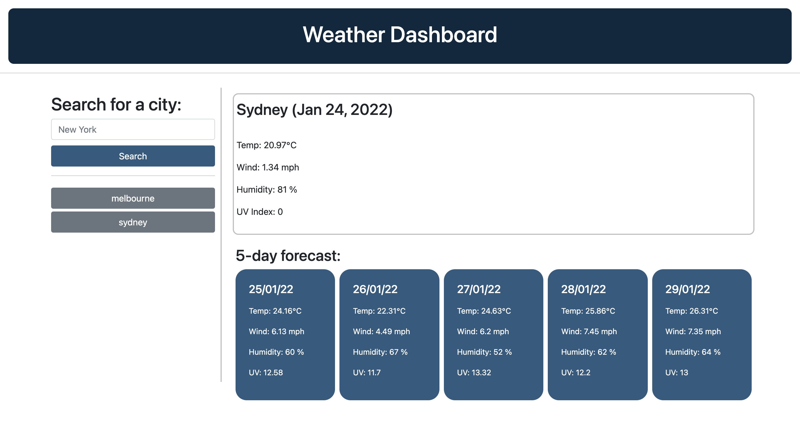

# <Weather-Dashboard-by-Roman_Ac>

# Mission
    * to build a weather dashboard so that user can see the weather outlook for diferent cities and plan the travel accordingly
    * to feature dynamically updated HTML & CSS
    * have a clean, polished and responsive user interface

# Parameters
    
    * upon opening the page user can search for the city for current and future weather conditions
    * when the weather data is displayed, it is displayed alongside city name, corresponding dates abd icons 
    * weather parameters includes temperature, humidity, wind speed and uv index
    * UV index are presented with color indicating severity 
    * future weather conditions include forecast for next 5 days
    * searched city are saved in local storage
    * when click on saved city, corresponding weather data is displayed

# Link to the page

https://roman-ac.github.io/weather-dashboard-by-roman-ac/

# Screenshot

   